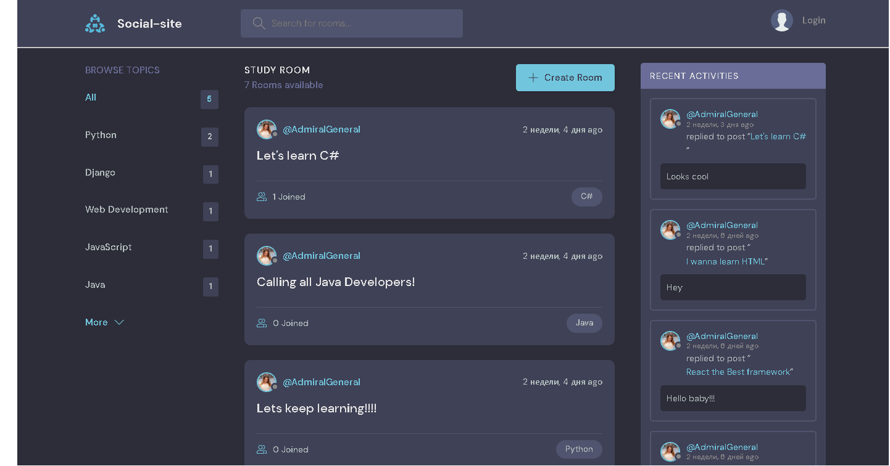

# social_site
https://img.shields.io/github/last-commit/David2261/social_site

## What I did in the project
*The project is a light form of messenger (similar to reddit);
In which you can create an article and choose a topic, and leave a comment;
You can login or make new account;
A form for the api has been created;*

## When writing this manual, I used:
- windows  10
- python  3.7
- django  3.0
- drf  3.11
- docker  20.10.12
- docker compose 2.2.3

## Getting Started
- First you need to create an environment:
  - For that you need install virtualenv
    - `pip install virtualenv`
- After that you can create your new environment:
`virtualenv venv`
- Second you need activate env
- If you using windows, you can activate env like me:
`venv\Scripts\activate`
- Thirt you need install all pip's which contain in requirements.txt:
  - `pip install -r requirements`

## Nice your env created, right now we can work with project:
- First we make our migrations:
1. `python manage.py makemigrations`
2. `python manage.py migrate`
3. `python manage.py runserver`

## Main page:
